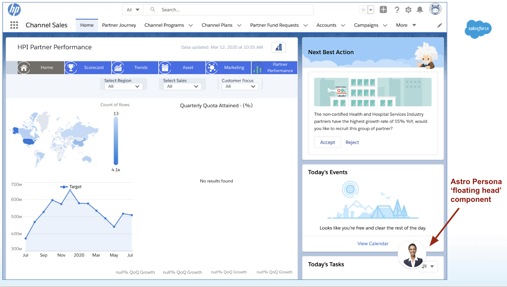
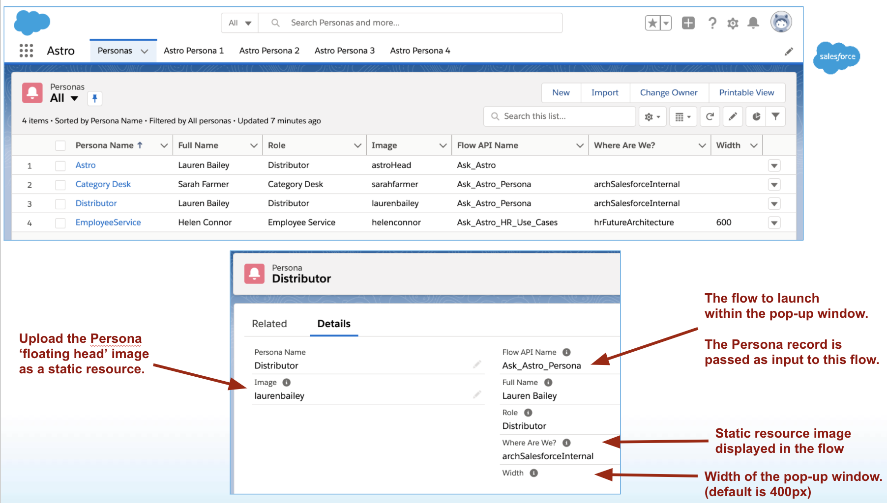
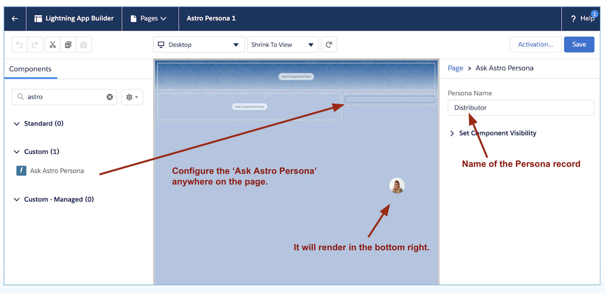

# sfdx-astro-persona

This is an SFDX project that extends the Hover Assistant (Ask Astro) component at https://github.com/forcedotcom/hover-assistant to provide a **Astro Persona** lightning component. This is a floating head that can be used for in-app guidance. I use it for describing in-context user personas for demos. This component can be used on any lightning page or Experience Cloud (formerly known as Communities) page.  

See this doc for more details: [Astro Persona component.pdf](docs/Astro%20Persona%20component.pdf)

## Development

To work on this project in a scratch org:

1. [Set up CumulusCI](https://cumulusci.readthedocs.io/en/latest/tutorial.html)
2. Run `cci flow run dev_org --org dev` to deploy this project.
3. Run `./scripts/assign-perm-set-to-user.sh` to assign permission set **rc_astro_persona** to the scratch org user. 
4. Run `cci org browser dev` to open the org in your browser.
5. In the org, open the 'Astro' app.

